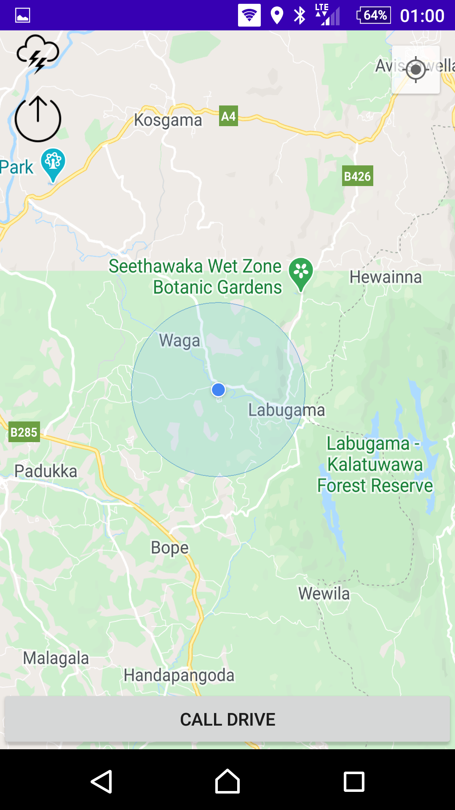
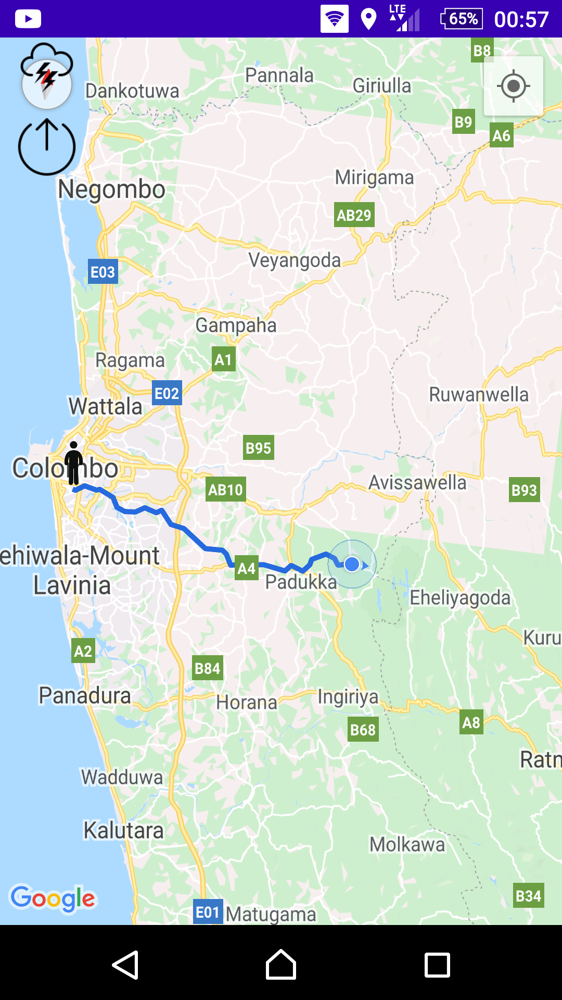
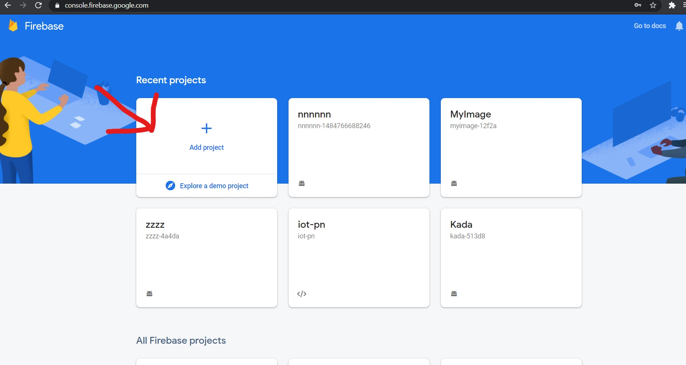
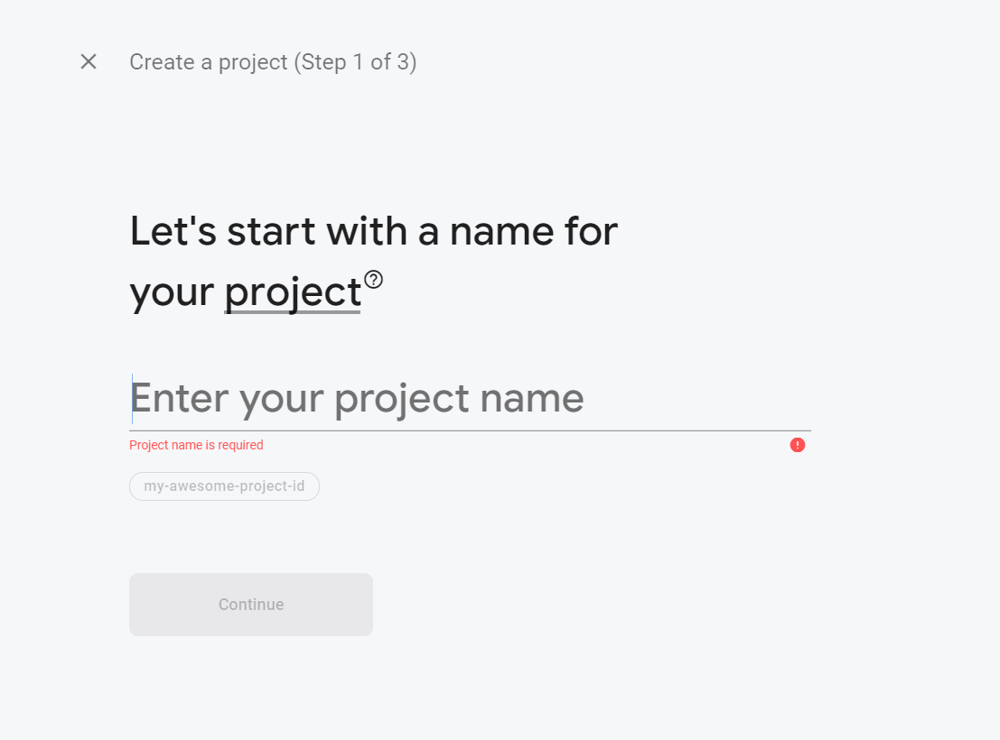
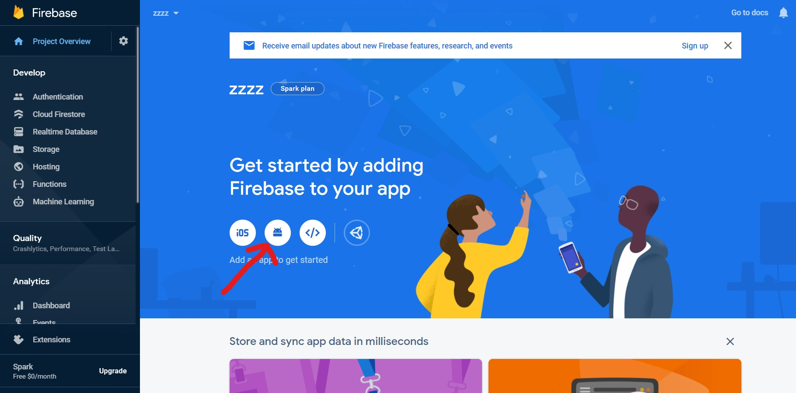
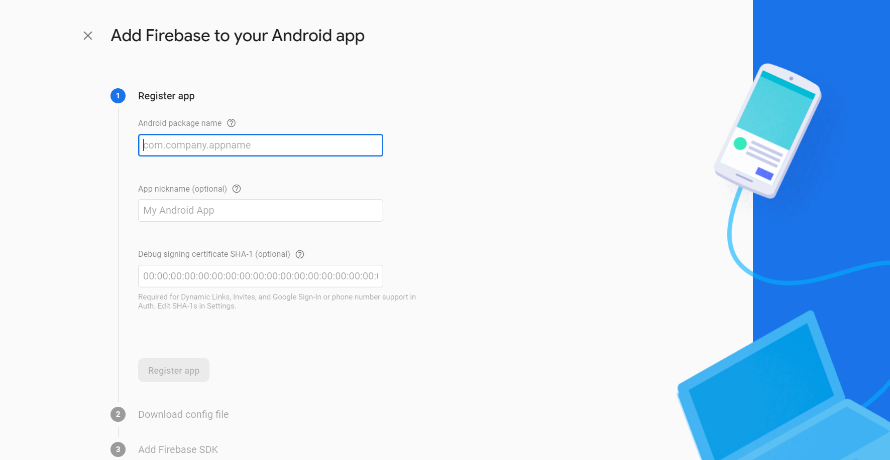
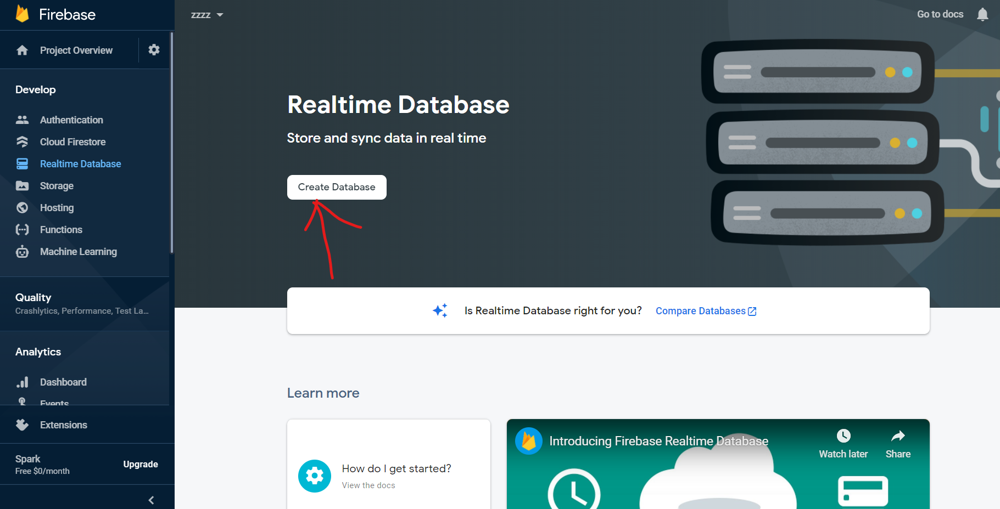
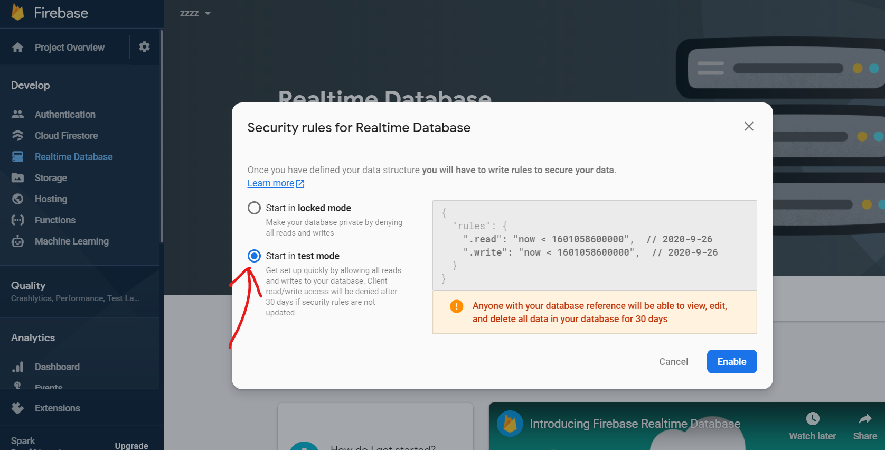

# RideMe
this project is android application like Uber app, PickMe app but project scope is small.

this project is build using java and use Firebase real time database.
 
                                                         RideMe app  ScreenShots  
                                                         
Customer interface 

Driver interface 

                                                         
                                                         

how to Step this project. 

1) Download this project.

2) After Downloading the project delete README file and ScreenShots folder.

3) Go to firebase console.
https://firebase.google.com/

4) If you haven't already, create a Firebase project: In the Firebase console, click Add project, then follow the on-screen instructions to create a Firebase project or to add Firebase services to an existing GCP project.

click Add project.

Enter Project name.

5) After creating your project,go to Created project and add android app  to your project.

Register your app and follow the instruction given there

   Android package name  com.exp.rideme 
  
 6) Create a Realtime Database 
  
  

  
  
 Use test mode as Security rule
 
 

7) Run project on android studio.

